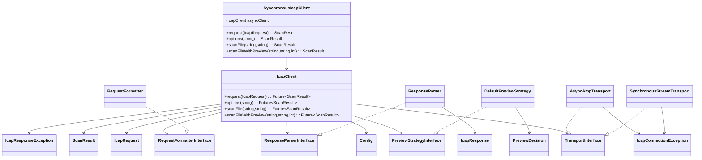

# Due-Diligence Analyse `ndrstmr/icap-flow` — Phase 1

Stand: 2026-04-23

## 1) Repository-Inventar (vollständige Dateiliste)

```text
.github/workflows/ci.yml
.gitignore
.php-cs-fixer.dist.php
CHANGELOG.md
CONTRIBUTING.md
LICENSE
README.md
composer.json
composer.lock
docs/agent.md
docs/assets/IcapFlow-logo.svg
examples/01-sync-scan.php
examples/02-async-scan.php
examples/cookbook/01-custom-headers.php
examples/cookbook/02-custom-preview-strategy.php
examples/cookbook/03-options-request.php
phpstan.neon
phpunit.xml.dist
src/Config.php
src/DTO/IcapRequest.php
src/DTO/IcapResponse.php
src/DTO/ScanResult.php
src/DefaultPreviewStrategy.php
src/Exception/IcapConnectionException.php
src/Exception/IcapResponseException.php
src/IcapClient.php
src/PreviewDecision.php
src/PreviewStrategyInterface.php
src/RequestFormatter.php
src/RequestFormatterInterface.php
src/ResponseParser.php
src/ResponseParserInterface.php
src/SynchronousIcapClient.php
src/Transport/AsyncAmpTransport.php
src/Transport/SynchronousStreamTransport.php
src/Transport/TransportInterface.php
tests/AsyncTestCase.php
tests/ConfigTest.php
tests/DTO/IcapRequestTest.php
tests/DTO/IcapResponseTest.php
tests/DTO/ScanResultTest.php
tests/DefaultPreviewStrategyTest.php
tests/IcapClientTest.php
tests/Pest.php
tests/RequestFormatterTest.php
tests/ResponseParserTest.php
tests/SynchronousIcapClientTest.php
tests/Transport/AsyncAmpTransportTest.php
tests/Transport/SynchronousStreamTransportTest.php
tests/Transport/TransportInterfaceTest.php
```

## 2) LOC-Auswertung und Test-zu-Code-Ratio

### `src/` LOC

| Datei | LOC |
|---|---:|
| src/Config.php | 64 |
| src/DTO/IcapRequest.php | 45 |
| src/DTO/IcapResponse.php | 42 |
| src/DTO/ScanResult.php | 42 |
| src/DefaultPreviewStrategy.php | 26 |
| src/Exception/IcapConnectionException.php | 14 |
| src/Exception/IcapResponseException.php | 14 |
| src/IcapClient.php | 181 |
| src/PreviewDecision.php | 15 |
| src/PreviewStrategyInterface.php | 18 |
| src/RequestFormatter.php | 57 |
| src/RequestFormatterInterface.php | 18 |
| src/ResponseParser.php | 68 |
| src/ResponseParserInterface.php | 18 |
| src/SynchronousIcapClient.php | 78 |
| src/Transport/AsyncAmpTransport.php | 58 |
| src/Transport/SynchronousStreamTransport.php | 34 |
| src/Transport/TransportInterface.php | 21 |
| **Summe `src/`** | **813** |

### `tests/` LOC

| Datei | LOC |
|---|---:|
| tests/AsyncTestCase.php | 15 |
| tests/ConfigTest.php | 21 |
| tests/DTO/IcapRequestTest.php | 12 |
| tests/DTO/IcapResponseTest.php | 11 |
| tests/DTO/ScanResultTest.php | 22 |
| tests/DefaultPreviewStrategyTest.php | 23 |
| tests/IcapClientTest.php | 256 |
| tests/Pest.php | 3 |
| tests/RequestFormatterTest.php | 43 |
| tests/ResponseParserTest.php | 30 |
| tests/SynchronousIcapClientTest.php | 118 |
| tests/Transport/AsyncAmpTransportTest.php | 19 |
| tests/Transport/SynchronousStreamTransportTest.php | 18 |
| tests/Transport/TransportInterfaceTest.php | 7 |
| **Summe `tests/`** | **598** |

**Test-zu-Code-Ratio (LOC-basiert)**: `598 / 813 ≈ 0,736` (≈ **73,6%**).

## 3) Klassen-/Interface-/Enum-Diagramm (textuell)



## 4) Dependency-Graph (`composer.json` + relevante transitive Abhängigkeiten)

### Runtime (direkt)

- `php: >=8.3`
- `amphp/socket:^2.3`

### Runtime (transitiv, sicherheits-/laufzeitrelevant)

- `amphp/amp v3.1.0`
- `amphp/byte-stream v2.1.2`
- `amphp/cache v2.0.1`
- `amphp/dns v2.4.0`
- `amphp/parser v1.1.1`
- `amphp/pipeline v1.2.3`
- `amphp/process v2.0.3`
- `amphp/serialization v1.0.0`
- `amphp/socket v2.3.1`
- `amphp/sync v2.3.0`
- `revolt/event-loop v1.0.7`
- `psr/http-message 2.0`
- `psr/http-factory 1.1.0`

### Development (direkt)

- `friendsofphp/php-cs-fixer:^3.75`
- `mockery/mockery:^1.6`
- `pestphp/pest:^3.8`
- `phpstan/phpstan:^1.11`
- `phpunit/phpunit:^11.2`

### Development (beispielhaft transitiv)

- Symfony Tooling-Komponenten: `symfony/console`, `symfony/process`, `symfony/finder`, `symfony/string`, …
- PHPUnit/Code-Coverage Stack: `phpunit/php-code-coverage`, diverse `sebastian/*`
- PSR-Utility: `psr/log`, `psr/container`, `psr/event-dispatcher`, `psr/simple-cache`

## 5) Öffentliche API-Oberfläche (SemVer-relevant)

### Public Klassen / Interfaces / Enum im Namespace `Ndrstmr\Icap`

- `Config`
- `IcapClient`
- `SynchronousIcapClient`
- `DefaultPreviewStrategy`
- `PreviewStrategyInterface`
- `PreviewDecision` (enum)
- `RequestFormatter`, `RequestFormatterInterface`
- `ResponseParser`, `ResponseParserInterface`
- `DTO\IcapRequest`, `DTO\IcapResponse`, `DTO\ScanResult`
- `Transport\TransportInterface`, `Transport\AsyncAmpTransport`, `Transport\SynchronousStreamTransport`
- `Exception\IcapConnectionException`, `Exception\IcapResponseException`

### Public Methoden (Auszug nach Typen)

- `IcapClient`: `request`, `options`, `scanFile`, `scanFileWithPreview`
- `SynchronousIcapClient`: `request`, `options`, `scanFile`, `scanFileWithPreview`
- `Config`: `getSocketTimeout`, `getStreamTimeout`, `withVirusFoundHeader`, `getVirusFoundHeader`
- DTO-Wither/APIs: `IcapRequest::withHeader`, `IcapResponse::withHeader`, `ScanResult::{isInfected,getVirusName,getOriginalResponse}`
- Contracts: `TransportInterface::request`, `RequestFormatterInterface::format`, `ResponseParserInterface::parse`, `PreviewStrategyInterface::handlePreviewResponse`

## 6) Erste Einordnung (nur Phase 1, ohne Tiefenbewertung)

- Das Repository ist **kompakt** und überschaubar (insgesamt ~1,4k LOC in `src+tests`).
- Der öffentliche API-Scope ist für `v1.0.0` bereits relativ breit (Core, DTOs, Transport, Parser, Formatter, Preview-Strategie).
- Async-Stack basiert auf `amphp/socket` und damit implizit auf `amphp/amp` + `revolt/event-loop`.
- CI, PHPStan und Style-Checks sind vorhanden; Detailprüfung erfolgt in den nächsten Phasen.
