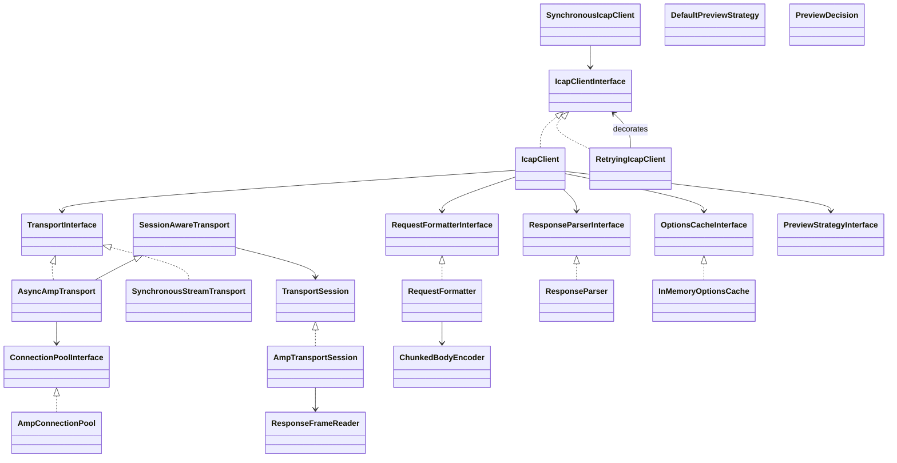

# Deep Research Audit — ICapFlow v2.1.0 (Produktionsreife & Technical Excellence)

**Stand:** 2026-04-25  
**Auditor:** unabhängige Code-Review (Repository-first, keine Self-Report-Übernahme)  
**Scope:** vollständiges Repository `ndrstmr/icap-flow` auf Branch-Stand `8b777be`

---

## 1) Executive Summary

`icap-flow` v2.1.0 ist gegenüber v1 technisch **massiv gereift**: korrektere RFC-3507-Wire-Erzeugung, fail-secure Status-Mapping, parserseitige DoS-Limits, TLS im Async-Transport, Response-Framing ohne `Connection: close`-Hack und nun Keep-Alive + Session-API für strict Preview-Continue auf demselben Socket. Die zentralen v1-Blocker (A–N) sind im Code weitgehend nachweisbar geschlossen.

Die Bibliothek ist damit für **Pilot- und kontrollierte Produktionsszenarien** realistisch einsetzbar, aber für „Security-Gateway im öffentlichen Sektor mit hohem Assurance-Level“ bleiben Lücken:

- kein Multi-Process-/Distributed OPTIONS-Cache-Adapter (nur In-Memory),
- kein offizielles Symfony-Bundle (DI, Profiler, Health/Telemetry fehlen),
- potenzielle Pool-Key-Konfusion (TLS-Context nicht im Key),
- kein servergetriebener Abgleich von `Max-Connections` / `Preview` aus OPTIONS in der Runtime-Policy.

**TRL-Einschätzung:** v2.1.0 ≈ **TRL 7** (System-Prototyp in realistischer Umgebung, inkl. CI-Integration mit c-icap/ClamAV); v1 war eher TRL 4–5.

**Produktions-Gate:**
- interne Tools/Portal-Backoffice: **Ja, mit Guards**,
- allgemeine Symfony-Projekte: **Ja, mit Einschränkungen**,
- sicherheitskritischer Upload-Gateway-Blocking-Path: **Mit Einschränkungen, nicht „perfekt“ ohne P0/P1-Nacharbeit**.

---

## 2) Repository-Inventar (Phase 1)

### 2.1 Dateibestand & LOC

- `src/`: **3570 LOC**
- `tests/`: **3095 LOC**
- Gesamt `src+tests`: **6665 LOC**
- Test-zu-Code-Ratio (`tests/src`): **0.87**

Messung via:

```bash
wc -l $(find src -type f | sort) | tail -n 1
wc -l $(find tests -type f | sort) | tail -n 1
```

### 2.2 Klassen-/Interface-Überblick (Mermaid)



### 2.3 Dependency-Graph (runtime/dev, sicherheitsrelevante Pfade)

Direkte Runtime-Dependencies:
- `php:^8.4`
- `amphp/socket:^2.3`
- `psr/log:^3.0`
- `revolt/event-loop:^1.0`

Security-/Infra-Dev:
- `roave/security-advisories:dev-latest`
- `phpstan/phpstan:^2.1`
- `pestphp/pest:^3.8`
- `phpunit/phpunit:^11.2`

Transitiv (Auszug `amphp/socket`): zieht u.a. `amphp/amp`, `amphp/byte-stream`, `amphp/dns`, mehrfach `revolt/event-loop`-abhängige Komponenten.

### 2.4 Public API Surface (SemVer-relevant)

**Interfaces:**
- `IcapClientInterface::request/options/scanFile/scanFileWithPreview`
- `TransportInterface::request`
- `SessionAwareTransport::openSession`
- `TransportSession::write/readResponse/release/close`
- `ConnectionPoolInterface::acquire/release/close`
- `RequestFormatterInterface::format`
- `ResponseParserInterface::parse`
- `PreviewStrategyInterface::handlePreviewResponse`
- `OptionsCacheInterface::get/set/delete`

**Final classes with public methods:**
- `IcapClient`, `RetryingIcapClient`, `SynchronousIcapClient`, `Config`
- `RequestFormatter`, `ResponseParser`, `ChunkedBodyEncoder`
- `AsyncAmpTransport`, `SynchronousStreamTransport`, `AmpConnectionPool`, `AmpTransportSession`, `ResponseFrameReader`
- DTOs + Exceptions

---

## 3) Closure-Verifikation v1-Findings (A–N) + M3-Follow-ups + v2.1-Themen

| ID | Status | Verifikation am Code |
|---|---|---|
| A Encapsulated hardcoded | **geschlossen** | Offsets werden dynamisch in `buildEncapsulatedHeader()` berechnet. |
| B keine HTTP-in-ICAP-Kapselung | **geschlossen** | `renderHttpRequestHeaders()` / `renderHttpResponseHeaders()` erzeugen RFC-konforme HTTP-Headerblöcke im Encapsulated-Teil. |
| C String-Body nicht chunked | **geschlossen** | `ChunkedBodyEncoder::encode()` behandelt string+resource chunked. |
| D kein `ieof` | **geschlossen** | `previewIsComplete=true` setzt Terminator `0; ieof\r\n\r\n`. |
| E Preview lädt komplette Datei | **teilweise geschlossen** | Strict path streamt; Legacy path macht bei Continue `rewind()` und vollständigen Re-Request. |
| F Parser ignoriert Encapsulated | **geschlossen** | `extractDecodedBody()` nutzt `Encapsulated` + Body-Offset. |
| G Fail-open auf 100 | **geschlossen** | `interpretResponse()` wirft bei `100` außerhalb Preview `IcapProtocolException`. |
| H CRLF-Injection Service | **geschlossen** | `validateServicePath()` blockt Controls/Whitespace/NUL; Header-Validation separat. |
| I Sync transport hardcoded/unsafe | **geschlossen** | Timeout aus Config, try/finally close, framing reader + limits. |
| J kein TLS | **geschlossen (async)** | `AsyncAmpTransport` + Pool-Connector nutzen `connectTls()` bei TLS-Context. |
| K Bug-zementierender Test | **geschlossen** | Neue Wire-Tests mit handberechneten Byte-Streams (`tests/Wire/*`). |
| L kein `Allow: 204` | **geschlossen** | Preview-Pfade setzen `Allow: 204`. |
| M Status-Matrix lückenhaft | **geschlossen** | 204 clean; 200/206 Header-Inspektion; 4xx/5xx typed exceptions; 100 fail-secure. |
| N Parser ohne DoS-Limits | **geschlossen** | Header-Count/Line-Limits im Parser; Response-Size + Header-Line-Limit im Framing reader. |
| M3: Cancellation | **geschlossen** | API + Transport akzeptieren `?Cancellation`, Async via Composite+Timeout. |
| M3: OPTIONS cache | **geschlossen (Basis)** | `Options-TTL` wird gelesen, InMemory TTL-Cache aktiv. |
| M3: 503 Retry | **geschlossen** | `RetryingIcapClient` retry nur auf `IcapServerException`. |
| M3: Response-Framing | **geschlossen** | `ResponseFrameReader` framed per headers/body terminator statt socket EOF. |
| v2.1: Keep-Alive-Pool | **geschlossen mit Gap** | Pool vorhanden; Gap: Pool-Key berücksichtigt TLS-Context-Identität nicht. |
| v2.1: strict §4.5 | **geschlossen** | Session-basierter same-socket Preview+Continue Pfad + Test auf 1 Connector-Call. |

---

## 4) Detaillierte Findings nach Dimension

### 4.1 Architektur/Design

**Stark:** klare Trennung `Client -> Formatter/Parser -> Transport -> Session/Pool`, guter Decorator-Schnitt für Retry.

**Gap (P1):** `IcapClient::scanFileWithPreviewStrict()` liest den Remainder via `stream_get_contents()` in einen String, statt chunkweise zu streamen; bei großen Dateien unnötiger Memory-Peak.

### 4.2 Security

**Stark:**
- fail-secure mapping,
- CRLF/NUL Guards auf Service + Header,
- parser- und framingseitige Limits,
- strukturierte Logs ohne Header-Dumps.

**Kritisch zu bewerten (P0/P1):**
- Pool-Key = `host:port[:tls]` ohne TLS-Context-Fingerprint; mehrere Mandanten mit abweichendem mTLS/pinning könnten denselben Idle-Socket teilen.

### 4.3 RFC/Protocol

- Request-Line + Encapsulated-Offsets + chunked terminators: gut umgesetzt.
- `ResponseParser` akzeptiert `ICAP/1.0` und `1.1`.
- RFC-7230 obs-fold Unterstützung vorhanden.

**Gap (P1):** OPTIONS-Daten (`Preview`, `Max-Connections`) werden nicht in Runtime-Policy zurückgeführt (nur TTL wird genutzt).

### 4.4 Testing/QA

- Unit-Suite: 91 passed / 187 assertions.
- Wire-, Security-, Transport-, Integration-Schichten sauber getrennt.
- Integration-job in CI hat `continue-on-error: true` → reduziert Gate-Schärfe.

**Gap (P1):** kein Mutation-Job in CI; lokal vorhanden, aber nicht enforcebar.

### 4.5 Symfony-/Ökosystem-Fit

Core bleibt framework-agnostisch (gut).  
Es fehlt jedoch ein offizielles Bundle (DI config tree, aliases, cache adapter, profiler collector, health checks).

---

## 5) RFC-3507 Compliance Checkliste (v2.1)

| Thema | Status | Kommentar |
|---|---|---|
| OPTIONS/REQMOD/RESPMOD Oberflächen | ✅ | vorhanden |
| Encapsulated offsets korrekt | ✅ | formatter-seitig berechnet |
| HTTP-in-ICAP Headers | ✅ | request/response header rendering |
| Chunked body encoding | ✅ | shared encoder |
| Preview `ieof` | ✅ | `previewIsComplete` |
| Strict preview-continue same socket | ✅ | SessionAwareTransport + strict path |
| 100 außerhalb Preview fail-secure | ✅ | protocol exception |
| 4xx/5xx typed errors | ✅ | client/server exception mapping |
| DoS-Limits parser+framer | ✅ | dual enforcement |
| OPTIONS TTL caching | ✅ | InMemory cache |
| OPTIONS-driven preview auto-negotiation | ❌ | caller muss Preview-Größe selbst setzen |
| Max-Connections auf Pool anwenden | ❌ | derzeit nur Kommentar/future enhancement |

---

## 6) Pool / Session Threat-Analyse (v2.1 Kern)

### Bedrohungsszenarien

1. **Cross-tenant TLS context confusion**  
   Gleicher Host/Port + TLS=true, aber unterschiedliches Pinning/mTLS in verschiedenen `Config`s → gemeinsamer Pool-Key möglich.

2. **TOCTOU Closed-Socket Race**  
   `isClosed()`-Check beim Acquire/Release kann zwischen Check und IO kippen; mitigiert durch close-on-Throwable im Transport.

3. **Mid-read Cancellation**  
   Async-Transport setzt bei Throwable `closeForced=true` und schließt Socket sicherheitshalber statt Reuse.

4. **Server half-close ohne Header**  
   wird bei nächster Nutzung als parse/framing failure erkannt; Socket wird verworfen.

### Empfehlung

- Pool-Key auf TLS-Policy ausweiten (z. B. Fingerprint aus serialisiertem TLS-Kontext oder expliziter `poolPartitionKey` in Config).
- Optional Idle-Eviction + max-idle-age einführen.

---

## 7) Wettbewerbsvergleich (Kurz)

| Ökosystem | Typische Stärken vs. icap-flow |
|---|---|
| Java ICAP libs | längere Betriebsreife, teils umfangreichere pooling/metrics hooks |
| Python (`pyicap` etc.) | einfache Nutzung, aber oft weniger strikt typed/test-hardened |
| Go ICAP clients | kompakte streaming clients, pragmatisch in infra workloads |
| PHP altpakete | meist älter, weniger RFC/async/pooling/cancellation-tief |

**Einordnung:** v2.1 ist im PHP-Ökosystem technisch ambitioniert; Differenzierung liegt in RFC-Wire-Tests + async + strict preview path.

---

## 8) Bewertungsmatrix (0–10)

| Dimension | v1 (ref) | v2.1 | Kurzbegründung |
|---|---:|---:|---|
| Sprachmoderne/Typen | 5 | 8 | readonly/final/override breit genutzt |
| Architektur/SOLID | 5 | 8 | klare Schichten, gute Dekoration |
| Exception-Design | 4 | 9 | Marker + typed matrix |
| RFC-Compliance | 3 | 8 | große Fortschritte, einige Policy-Gaps |
| Security Posture | 3 | 8 | fail-secure + guards + limits |
| Transport/Pooling | 2 | 7 | v2.1 stark, aber keying-gap |
| Async/Cancellation | 4 | 8 | End-to-end propagated |
| Testing/CI | 5 | 8 | starke Tests, CI integration weak-gated |
| Dokumentation | 6 | 8 | migration/review/changelog gut |
| Symfony-Fit | 4 | 5 | bundle/profiler fehlt |

**Gesamt grob:** v1 ~41/100 → v2.1 ~77/100.

---

## 9) Produktionsreife-Gate

- **Interne Tools / Prototypen:** **Ja**.
- **Symfony-Anwendungen allgemein:** **Ja, mit Einschränkungen**.
- **Kritischer Upload-Security-Gateway:** **Mit Einschränkungen** (P0/P1 zuerst adressieren).

---

## 10) Priorisierte Gap-Liste

### P0
1. Pool-Key-Härtung gegen TLS-Context-Konfusion.

### P1
1. Strict preview remainder chunkweise streamen (kein `stream_get_contents()`-buffering).
2. OPTIONS-getrieben `Preview`-Aushandlung optional automatisieren.
3. `Max-Connections` in Pool-Limits einfließen lassen.
4. Integration-CI aus `continue-on-error` herausführen (mindestens nightly hard-fail).
5. Mutation-Testing wieder in CI aufnehmen (stabilisierte Flags).
6. Symfony-Bundle (`icap-flow-bundle`) mit DI/Profiler/Health.

### P2
- Property-based tests für Parser/Framer.
- Parser fuzzing corpus.
- Benchmark-Suite (pool throughput, strict preview latency).

---

## 11) Roadmap

### v2.1.x (Patch)
- Pool-Key fix + Tests,
- Docs: klare Hinweise zu multi-tenant TLS und cache scope,
- CI memory-limit für PHPStan script stabilisieren.

### v2.2.0 (Minor)
- OPTIONS-driven preview negotiation,
- adaptive pool cap (`Max-Connections`),
- PSR-6/16 cache adapters,
- OpenTelemetry decorator.

### v2.3.0 (Minor)
- separates `icap-flow-bundle` Repo (Symfony DI, aliases, profiler, command, validator).

### v3.0.0 (nur falls nötig)
- nur bei echten BC-Zielen (z. B. Pool key contract / transport interface break).

---

## 12) Quellen

### Primärquellen (Standards)
- RFC 3507 (ICAP): https://www.rfc-editor.org/rfc/rfc3507
- RFC 7230 (HTTP/1.1 syntax/routing, obs-fold/chunking historical): https://www.rfc-editor.org/rfc/rfc7230
- RFC 9110 (HTTP semantics, modern reference): https://www.rfc-editor.org/rfc/rfc9110

### Ökosystem/Referenz
- Amp Socket docs/repo: https://github.com/amphp/socket
- c-icap project page: https://sourceforge.net/projects/c-icap/
- Squid source tree (ICAP options logic): https://fossies.org/linux/www/squid-SQUID_7_0_2.tar.gz/squid-SQUID_7_0_2/src/adaptation/icap/Options.cc
- Packagist package page (`ndrstmr/icap-flow`): https://packagist.org/packages/ndrstmr/icap-flow

