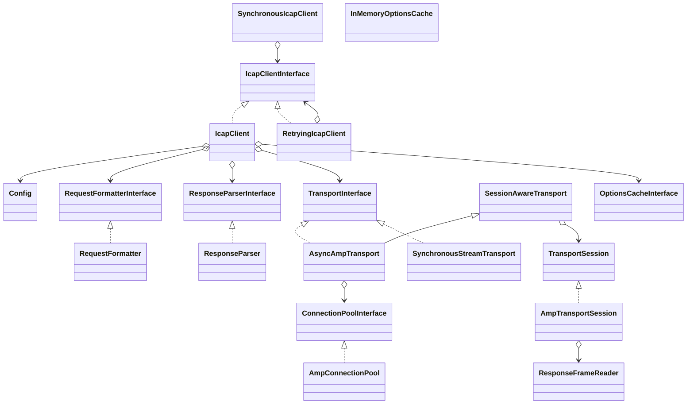

# ICapFlow v2.1.0 — Production-Readiness & Technical Excellence Audit (Codex)

**Datum:** 2026-04-25  
**Scope:** `ndrstmr/icap-flow` (lokaler Stand `HEAD` auf Branch `work`)  
**Methodik:** vollständige Repository-Inspektion (`src/`, `tests/`, `docs/`, CI), lokale Qualitätsläufe, RFC-/Ökosystem-Abgleich.

---

## 1) Executive Summary

**Kurzfazit:** v2.1.0 ist ein deutlicher Qualitätssprung gegenüber v1.0.0 und behebt die zentralen RFC-/Security-Blocker nachvollziehbar im Code (nicht nur in Self-Reports). Die Kern-Claims zu Wire-Format, fail-secure auf Status 100, DoS-Limits, OPTIONS-TTL-Cache, Retry-Decorator, Response-Framing sowie strict Preview-Continue (same socket) sind technisch belegt.  

**Produktionsreife (heute):**
- **Interne Tools/Prototypen:** **Ja**.
- **Symfony-Projekte allgemein:** **Ja, mit Einschränkungen** (fehlendes offizielles Bundle/Observability-Integrationen).
- **Security-kritisches Upload-Gateway (Behördenkontext):** **Mit Einschränkungen**. Kernlogik ist robust, aber es gibt verbliebene Risiken in Betriebs-/Integrationsfragen (z. B. Pool-Key nur `host:port[:tls]` statt TLS-Context-sensitiv, keine OPTIONS-getriebene Preview-Aushandlung, Integration-Job in CI `continue-on-error`).

**Top-2 technische Risiken (neu/noch offen):**
1. **Pool-Key kann TLS-Context-Varianten vermischen** (potenziell Cross-Tenant-/Policy-Verwechslung) in `AmpConnectionPool::key()` (`host:port[:tls]` binär, nicht Context-differenziert).  
2. **Strict Preview-Pfad liest Remainder via `stream_get_contents()` als String** (nicht chunkweise), d. h. bei sehr großen Restdaten steigt Peak-Memory (`IcapClient::scanFileWithPreviewStrict()`).

**TRL-Einschätzung:**
- **v1.0.0 (geschätzt): TRL 4–5** (funktionaler Prototyp, aber RFC/security-blockierende Defizite).  
- **v2.1.0: TRL 7** (system prototype demonstrated in operationally relevant environment; Integration gegen c-icap/ClamAV vorhanden, aber noch kein breiter Vendor-/Ops-Härtungsgrad).

---

## 2) Repository-Inventar v2.1.0 (Phase 1)

### 2.1 LOC & Struktur

- `src/`: **37 Dateien**, **3569 LOC**.
- `tests/`: **30 Dateien**, **3095 LOC**.
- Test-zu-Code-Ratio (LOC): **0.87**.

### 2.2 Öffentliche API-Oberfläche (SemVer-relevant)

Wesentliche Contracts:
- `IcapClientInterface`: `request()`, `options()`, `scanFile()`, `scanFileWithPreview()`.
- `TransportInterface` + `SessionAwareTransport` + `TransportSession`.
- `RequestFormatterInterface::format(): iterable<string>`.
- `ResponseParserInterface::parse(): IcapResponse`.
- `OptionsCacheInterface`.

Implementierungen sind überwiegend `final`, `#[\Override]` wird konsequent verwendet.

### 2.3 Architektur-Skizze (Mermaid)

### 2.4 Dependency-Graph (Runtime/Dev)

Runtime (`composer.json`): `php ^8.4`, `amphp/socket ^2.3`, `psr/log ^3.0`, `revolt/event-loop ^1.0`.  
Dev: Pest 3, PHPUnit 11, PHPStan 2.1, CS Fixer, Mockery, `roave/security-advisories`.

### 2.5 v2.0-Closure-Verifikation (A–N + M3/M3-ext + v2.1)

Siehe Abschnitt 3 (tabellarisch, einzeln verifiziert am Code).

---

## 3) v1-Findings-Closure-Verifikation

| ID | Status | Verifikation (Code) | Urteil |
|---|---|---|---|
| A Encapsulated hardcoded | **geschlossen** | `RequestFormatter::buildEncapsulatedHeader()` berechnet Offsets dynamisch | belastbar |
| B HTTP-in-ICAP fehlt | **geschlossen** | `renderHttpRequestHeaders()/renderHttpResponseHeaders()` + DTO-Slots in `IcapRequest` | belastbar |
| C String body nicht chunked | **geschlossen** | `ChunkedBodyEncoder::encode()` für String/Resource | belastbar |
| D kein `ieof` | **geschlossen** | Terminator `0; ieof\r\n\r\n` bei `previewIsComplete=true` | belastbar |
| E Preview lädt alles in RAM | **teilweise geschlossen** | Preview selbst streamt; **strict continuation** nutzt `stream_get_contents()` (Remainder als String) | **Rest-Risiko** |
| F Parser ignoriert Encapsulated | **geschlossen** | `extractDecodedBody()` + `parseEncapsulatedHeader()` + chunk decode | belastbar |
| G Fail-open auf 100 | **geschlossen** | `interpretResponse(): code===100 -> IcapProtocolException` | sicherheitsrelevant behoben |
| H CRLF-Injection service/header | **geschlossen** | `validateServicePath()` + `validateIcapHeaders()` | robust |
| I Sync transport hardcoded/leaky | **geschlossen** | Config-timeouts, bounded loop via `ResponseFrameReader`, `finally fclose` | belastbar |
| J kein TLS | **geschlossen** | Async `connectTls()` via `ClientTlsContext`, sync verweigert TLS explizit | sauber |
| K Test zementiert Bug | **geschlossen** | Wire-Tests `tests/Wire/*` mit hand-computed fixtures | sehr gut |
| L kein Allow:204 Preview | **geschlossen** | Preview-Header Merge setzt `Allow: 204` | erfüllt |
| M lückenhafte Status-Matrix | **geschlossen** | 204/200/206/100/4xx/5xx mapped auf typed exceptions/results | erfüllt |
| N keine Parser-DoS-Limits | **geschlossen** | Limits in Parser + FrameReader | erfüllt |
| M3 Cancellation | **geschlossen** | API + Transport-Signaturen durchgereicht, Tests vorhanden | erfüllt |
| M3 OPTIONS-cache | **geschlossen** | `Options-TTL` in `options()` + `InMemoryOptionsCache` | erfüllt |
| M3 503 retry | **geschlossen** | `RetryingIcapClient` nur auf `IcapServerException` | erfüllt |
| M3 Response-Framing | **geschlossen** | `ResponseFrameReader` beendet ohne EOF/close-hack | erfüllt |
| v2.1 Pool | **teilweise** | Funktional vorhanden, aber TLS-context-agnostischer Key | **P1** |
| v2.1 strict §4.5 | **weitgehend** | same-socket mit Session, aber Remainder-Stringbuffer | **P1** |

---

## 4) Findings nach Dimension (Phase 2–6)

### 4.1 Faktische Stärken

- **Klare Schichten**: Client/Formatter/Parser/Transport/Decorator/Cache sind sauber getrennt.
- **Exception-Taxonomie** mit Marker-Interface ist konsistent.
- **Fail-secure-Mapping** ist explizit und testbar.
- **Framing-Reader** entfernt harte Abhängigkeit von `Connection: close`.
- **CI-Setup** solide (8.4+8.5, audit, style, tests, integration).

### 4.2 Kritische bzw. prioritäre Gaps

1) **Pool-Key-Sicherheit (P1, potenziell P0 je Mandantenmodell)**  
`AmpConnectionPool::key()` differenziert nur TLS ja/nein, nicht TLS-Policy (CA, Pinning, Client-Zertifikat). Mehrere `Config`-Instanzen mit gleichem Host/Port/TLS können denselben Socket teilen.

**Konkreter Fix-Vorschlag:**
- Pool-Key erweitern um deterministischen TLS-Fingerprint, z. B. `sha256(serializeTlsContextPolicy(config))` oder explizite `connectionProfileId` in `Config`.

2) **Strict preview continuation puffert Rest als String (P1)**  
`scanFileWithPreviewStrict()` nutzt `stream_get_contents($stream)` und schreibt danach als einen String durch `ChunkedBodyEncoder`.

**Konkreter Fix-Vorschlag:**
- `ChunkedBodyEncoder` um `encodeRemainderFromStream(resource $stream, int $chunkSize=8192)` erweitern (ohne `rewind`), dann `yield` direkt in `session->write()`.

3) **OPTIONS `Max-Connections` wird nicht genutzt (P1)**  
RFC-seitige Information wird geparst, aber nicht in Pool-Kapazität rückgekoppelt.

**Konkreter Fix-Vorschlag:**
- Optionales Auto-Tuning im Pool: `effectiveCap = min(localCap, serverMaxConnections)`.

4) **Preview-Größe nicht aus OPTIONS abgeleitet (P1)**
- Aktuell caller-gesteuert (`scanFileWithPreview(..., $previewSize)`), kein automatischer Bezug auf `Preview`-Header.

5) **Integration-Job `continue-on-error: true` (P1/P2)**
- Kann rote Integrationssignale maskieren.

6) **`phpunit.xml.dist`: `failOnRisky=false`, `failOnWarning=false` (P2)**
- Aktuell 3 risky tests im Unit-Run.

7) **Symfony-Ökosystem-Lücke (P1)**
- Kein offizielles Bundle/DI-Autoconfig/Profiler/Monolog-Channel/Command/Constraint.

---

## 5) ICAP RFC 3507 Compliance-Checkliste (v2.1)

| Bereich | Status | Kommentar |
|---|---|---|
| OPTIONS req/resp | ✅ | inklusive Options-TTL-Cache |
| REQMOD/RESPMOD | ✅ | typisierte Encapsulated-Slots |
| Encapsulated offsets | ✅ | hand-computed Wire-Tests |
| Chunked encoding | ✅ | inkl. `ieof` im Preview-Complete |
| Preview §4.5 strict same-socket | ✅/⚠️ | same-socket korrekt; Remainder-Buffering optimierbar |
| Status semantics 100/204/200/206/4xx/5xx | ✅ | fail-secure auf 100 außerhalb Preview |
| Parser folding RFC 7230 §3.2.4 | ✅ | obs-fold als continuation behandelt |
| DoS limits | ✅ | Parser + FrameReader |

---

## 6) Pool / Session-Lifecycle Threat-Analyse

### Bedrohungsszenarien

1. **Cross-config socket reuse** (TLS policy confusion).  
2. **Cancellation mitten im Exchange**: in `AsyncAmpTransport::request()` wird bei Throwable `closeForced=true` gesetzt → defensive socket disposal (gut).  
3. **Half-closed sockets**: closed sockets werden bei acquire/release verworfen; TOCTOU bleibt inhärent, aber durch Exception->close-Pfad abgefedert.  
4. **Protocol desync nach Fehlern**: strict preview-path schließt Session im catch-Block (gut).

### Bewertung

- Lifecycle-Design ist grundsätzlich sauber (release vs close, disposed-guard, idempotentes close/release).
- Größtes Restrisiko bleibt Key-Granularität im Pool.

---

## 7) Wettbewerbsvergleich (Kurz)

| Ökosystem | Beispiel | Reifeindiz |
|---|---|---|
| PHP | `ndrstmr/icap-flow` | modern (PHP 8.4+, async, tests, strict preview) |
| PHP | `nathan242/php-icap-client` | älter, PHP>=5.3, letztes Release 2023 |
| Go | `egirna/icap-client` | vorhanden, älterer Stand |
| Rust | `icap-rs` | sehr aktiv (2025/2026), client+server, streaming/features, „work in progress“ |
| Python | `pyicap` | Fokus Server-Framework, alt (2017) |
| .NET | `IcapClient` NuGet | existiert, junge Versionen |

**Einordnung:** Für PHP wirkt `icap-flow` im Jahr 2026 technisch vorne, aber ohne offizielles Symfony-Bundle bleibt Integrationshürde höher als nötig.

---

## 8) Bewertungsmatrix (0–10)

| Dimension | v1 (Ref.) | v2.1 | Kurzbegründung |
|---|---:|---:|---|
| Sprachmoderne | 4 | 8 | readonly/final/override, aber kaum 8.4-spezifische Features |
| Typsystem/PHPStan | 5 | 8 | strong typing; CI-run lokal memory-issue beachten |
| SOLID/Architektur | 4 | 9 | klare Schichtung + Decorator/Strategy/Pool |
| Exception-Design | 3 | 9 | marker + klare Klassen |
| PSR-Konformität | 5 | 8 | PSR-3/4 gut; bewusst kein PSR-7 |
| Ressourcen/Connections | 3 | 8 | robust framing/lifecycle |
| Pool-Korrektheit | n/a | 7 | gut, aber TLS-key-gap |
| Async (Amp/Revolt) | 4 | 8 | sauber, cancellation-paths vorhanden |
| Cancellation | n/a | 8 | API->transport propagiert |
| RFC3507 Methoden | 4 | 8 | praktisch vollständig |
| Strict Preview §4.5 | n/a | 8 | same-socket korrekt, remainder buffering gap |
| Options-TTL cache | n/a | 8 | vorhanden, minimalistisch |
| Parser-Robustheit | 3 | 8 | folding + limits |
| Multi-vendor headers | n/a | 8 | konfigurierbare Headerliste |
| Security Posture | 3 | 8 | deutlicher Sprung, 1–2 Restthemen |
| Test-Coverage | 5 | 8 | starke suite, risky tests verbleiben |
| Wire-Format-Tests | n/a | 9 | hand-computed byte fixtures |
| Mutation in CI | 2 | 4 | lokal vorhanden, CI fehlt |
| Integrations-Tests | 4 | 7 | real stack, aber continue-on-error |
| CI-Qualität | 5 | 7 | gut, aber Integrationssignal abgeschwächt |
| Doku | 5 | 8 | stark verbessert |
| Examples/Cookbook | 5 | 7 | gut, aber keine bundle-nahen patterns |
| Symfony-Integration | 3 | 4 | bundle fehlt |
| Observability | 2 | 6 | PSR-3 gut, OTel/metrics fehlen |
| Release/SemVer | 5 | 8 | changelog + breaking clarity |
| Public-Sector-Fit | 6 | 8 | EUPL/OSS/Security-Hinweise gut |
| **Gesamt (/260)** | **109** | **200** | **klarer Reifegewinn** |

---

## 9) Produktionsreife-Gate

- **Interne Tools / Prototypen:** **Ja**.
- **Symfony-Projekte (TYPO3/Shopware/Portale):** **Ja, mit Einschränkungen**.
- **Kritische Security-Komponente:** **Mit Einschränkungen** (P1-Gaps zuerst schließen, dann Rollout mit Vendor-spezifischem E2E-Bakeout).

---

## 10) Priorisierte Gap-Liste

### P0
- Derzeit **kein eindeutiger P0-Codeblocker** verifiziert.

### P1
1. Pool-Key TLS-context-sensitiv machen.  
2. Strict-preview remainder streaming ohne String-Buffer.  
3. OPTIONS `Preview` und `Max-Connections` operational nutzen.  
4. Integration CI von `continue-on-error` auf harte Gate-Strategie (oder separat als required status).  
5. Symfony-Bundle starten.

### P2
- PSR-6/16 Cache-Adapter, OTel/Prometheus-Decorator, property-based/fuzz/bench suites, `failOnRisky=true` sobald Tests bereinigt.

### P3
- Multi-vendor Integration Pipeline (Symantec/Sophos/Trend/McAfee/Kaspersky), formale Parser-Modelle.

---

## 11) Roadmap v2.1.x → v2.2 → v2.3 → v3.0

- **v2.1.x (Patch):** Pool-key-hardening + strict-preview streaming fix + risky tests auflösen.  
- **v2.2.0 (Minor):** OPTIONS-driven preview/cap tuning, cache adapters, OTel decorator, health helper.  
- **v2.3.0 (Minor):** separates `icap-flow-bundle` (DI config, aliases, multi-client tags, commands, validator constraint).  
- **v3.0.0 (nur falls nötig):** API-break erst bei echtem Strukturbedarf (z. B. Pool-Key-Contract öffentlich).

---

## 12) Quellenverzeichnis

### Intern (Code)
- `src/IcapClient.php`
- `src/Transport/AmpConnectionPool.php`
- `src/Transport/AsyncAmpTransport.php`
- `src/Transport/AmpTransportSession.php`
- `src/Transport/ResponseFrameReader.php`
- `src/RequestFormatter.php`
- `src/ChunkedBodyEncoder.php`
- `src/ResponseParser.php`
- `src/Config.php`
- `src/Cache/InMemoryOptionsCache.php`
- `src/RetryingIcapClient.php`
- `tests/Wire/*`, `tests/Security/*`, `tests/Transport/*`, `tests/PreviewContinueStrictTest.php`, `tests/OptionsCacheTest.php`, `tests/RetryingIcapClientTest.php`, `tests/CancellationTest.php`
- `.github/workflows/ci.yml`, `composer.json`, `phpstan.neon`, `phpunit.xml.dist`, `README.md`, `CHANGELOG.md`, `docs/migration-v1-to-v2.md`, `docs/review/consolidated_task-list.md`

### Extern
- RFC 3507: https://datatracker.ietf.org/doc/html/rfc3507
- RFC 7230: https://www.rfc-editor.org/rfc/rfc7230
- RFC 9110: https://www.rfc-editor.org/rfc/rfc9110
- Amp socket docs: https://amphp.org/socket
- Packagist icap-flow: https://packagist.org/packages/ndrstmr/icap-flow
- c-icap releases: https://c-icap.sourceforge.net/download.html
- Packagist comparator (PHP): https://packagist.org/packages/nathan242/php-icap-client
- Go comparator: https://pkg.go.dev/github.com/egirna/icap-client
- Rust comparator: https://docs.rs/crate/icap-rs/latest
- Python comparator: https://pypi.org/project/pyicap/
- .NET comparator: https://www.nuget.org/packages/IcapClient
- Bundle existence check (404): https://github.com/ndrstmr/icap-flow-bundle
